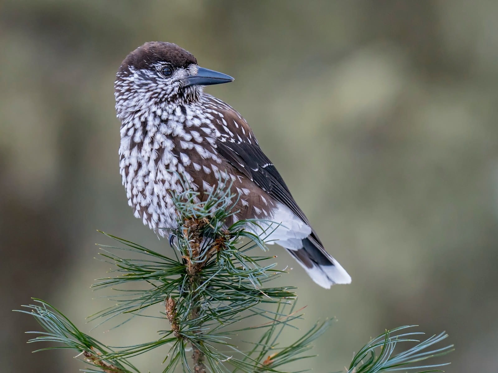

# Proposal for Semester Project

<!-- 
Please render a pdf version of this Markdown document with the command below (in your bash terminal) and push this file to Github. Please do not Rename this file (Readme.md has a special meaning on GitHub).

quarto render Readme.md --to pdf
-->

**Patterns & Trends in Environmental Data / Computational Movement Analysis Geo 880**

| Semester:      | FS25                                     |
|:---------------|:---------------------------------------- |
| **Data:**      | GPS and sensor data from 130 birds |
| **Title:**     | Analysis of Tannenhäher Movements and Habitat Use |
| **Student 1:** | Robin Merz                               |
| **Student 2:** | Claude Widmer                            |

## Abstract 
<!-- (50-60 words) -->
**@ Robin: bitte noch anpassen**

We analyze GPS and sensor data from 130 tagged Tannenhäher (Eurasian Nutcracker) to study movement patterns and habitat use. The focus is on seasonal differences in site selection and clustering of nesting and foraging locations. Additionally, we aim to identify caching and harvesting sites where the birds store food. The results will be presented in an interactive RShiny application, allowing users to explore movements and statistics.

## Research Questions
<!-- (50-60 words) -->
- How do the movement patterns of birds differ between summer and winter?
- What differences exist between adult and juvenile birds?
- To what extent do individual home ranges overlap seasonally?
- Can preferences for specific habitat structures be identified?
- How similar are the GPS tracks in terms of sinuosity and movement characteristics?
- Can machine learning improve the detection of movement clusters and behavior patterns?

## Results / products
<!-- (50-100 words) -->
<!-- What do you expect, anticipate? -->
**@ Robin: bitte noch anpassen**

We expect to identify specific foraging and nesting clusters using clustering algorithms. The analysis will provide insights into seasonal movement differences.

The final product includes an interactive RShiny application with a Leaflet map, showcasing bird movements and clustering results. Additionally, a story-map web application will be developed to visually present our objectives, research questions, and findings in an engaging, interactive way, effectively displaying the birds and their data.

## Data
<!-- (100-150 words) -->
<!-- What data will you use? Will you require additional context data? Where do you get this data from? Do you already have all the data? -->
The data consists of raw GPS and sensor data from 130 birds, with a subset remaining active as of March 2025. In addition, we will integrate other data sources, such as landcover types. The data is provided by the Vogelwarte Switzerland ([@robin, please verify]) and is stored in a well-structured, non-relational CSV file. We already have all the data, although it will require substantial cleaning due to gaps caused by signal loss.
The dataset includes key information such as the bird’s id, GPS coordinates (longitude, latitude), altitude, and physical measurements like weight, wing length, and bill length. Other variables include timediff, steplength, as well as metadata such as tag type, breeding season, and capture date.

## Analytical concepts
<!-- (100-200 words) -->
<!-- Which analytical concepts will you use? What conceptual movement spaces and respective modelling approaches of trajectories will you be using? What additional spatial analysis methods will you be using? -->
We use various methods to study the birds' movement patterns and behaviors, helping us understand their habitat use and seasonal changes. Key methods include:

- **Clustering analysis:** We identify important areas like nesting, caching, and harvesting sites by grouping locations where birds spend a lot of time, using methods like DBSCAN and k-Means.

- **Machine learning integration:** We train models to detect movement patterns in GPS data, helping us spot behaviors like seasonal shifts and specific site selections.

- **Time-series analysis:** We analyze how the birds' movements change over time, especially during different seasons, to detect behavior changes related to migration, breeding, and foraging.

- **Overlap analysis:** We compare the areas used by different birds to see if they share home ranges, helping us understand competition and interactions.

- **Similarity analysis of GPS tracks:** We examine the movement paths of birds to group those with similar behaviors, looking at factors like path curviness and step length.

## R concepts
<!-- (50-100 words) -->
<!-- Which R concepts, functions, packages will you mainly use. What additional spatial analysis methods will you be using? -->
Main R packages used:
- **Spatial analysis:** `sf` for handling spatial data, `spatstat` for spatial point pattern analysis and KDE.  
- **Movement analysis:** `amt` for trajectory analysis, `move` for GPS data processing, `ctmm` for continuous-time movement modeling.  
- **Clustering & machine learning:** `dbscan`, `kmeans`, and `hclust` for detecting patterns and grouping data.  
- **Interactive visualization:** `shiny` for web apps, `leaflet` for maps, `ggplot2` for visualizing movement and clustering results.

## Risk analysis
<!-- (100-150 words) -->
<!-- What could be the biggest challenges/problems you might face? What is your plan B? -->
**@ Robin: bitte noch anpassen**

The biggest challenge is the data quality, as some GPS transmitters may have gaps or irregular signals. With around 50,000 data points, managing and analyzing such a large volume of data can be complex and time-consuming. To handle this, we may simplify the data by reducing the number of points, such as limiting the time frame, averaging data, or focusing on specific subsets of the data If these problems arise, we will prioritize creating clear visualizations and summaries that help users explore the data. This approach will allow users to better understand the movement patterns and make informed interpretations using the provided statistics.

## Questions?
<!-- (100-150 words) -->
<!-- Which questions would you like to discuss at the coaching session? -->
- What additional contextual data might be relevant for our analysis?
- Is the Rshiny Approach suitable for this Semester Project?